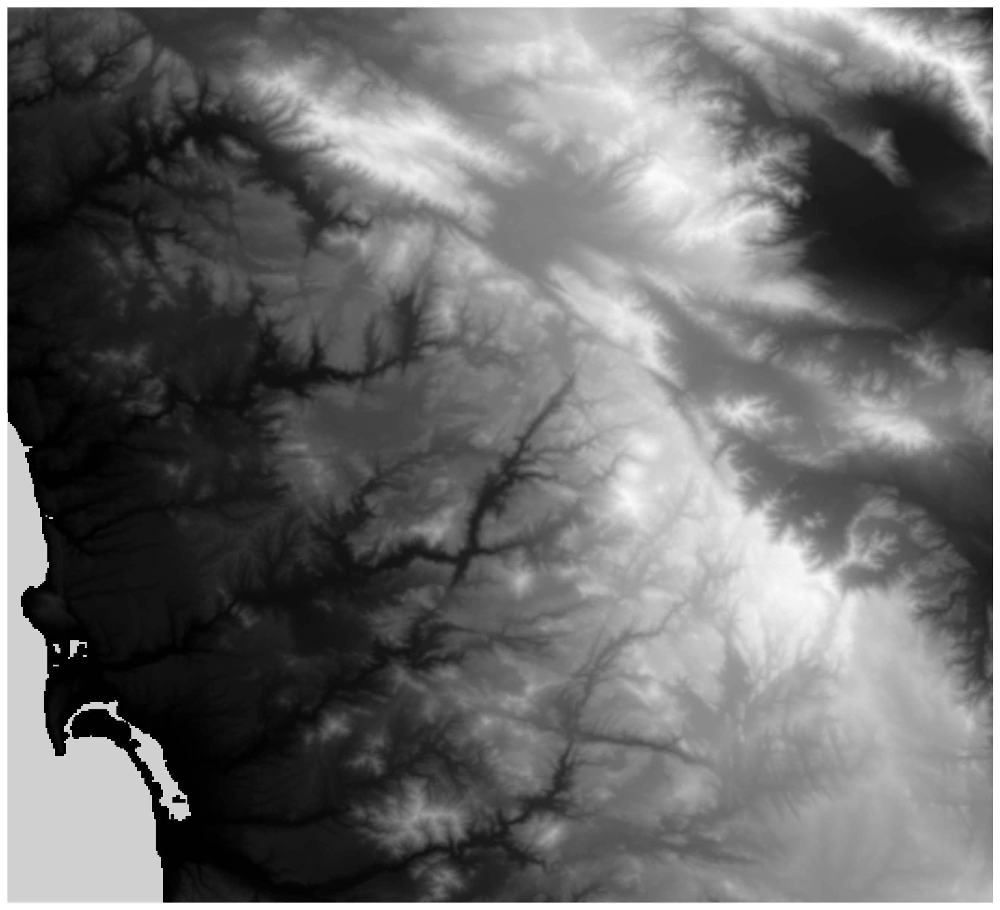

# Map generator

Generate maps based on spatial data.

## Example



## Get elevation data

Sign in here and create a map to download data: https://earthexplorer.usgs.gov/


## Run locally

Put downloaded tif files in the `data/` folder.

```bash

# create a new virtual environment
python 3.13 -m venv venv

# active environment
. venv/bin/activate

# install dependencies
pip install -U pip
pip install -r requirements.txt

```